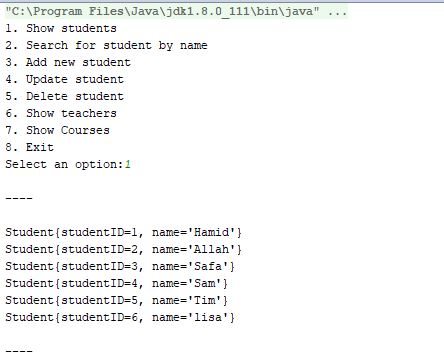

# School Example

A sample school application to demonstrate using Hibernate 4.3. It is a simple commandline application to show CRUD 
(creating, reading, updating, and deleting) data from the redi.sqlite database in the root directory.

To use sqlite, an [extra JAR](https://github.com/EnigmaBridge/hibernate4-sqlite-dialect) is required to specify the 
SQL dialect used, because it is not built into Hibernate like the other database providers.

Logging is directed to school.log to ensure that the command-line is not cluttered by hibernate activities. This is
specified in log4j.properties.
 
I chose to use the criteria API to perform the CRUD actions. The advantage is that the Criteria API allows type 
checking on values provided when you want to filter data (want ends up in the WHERE clause of a SQL statement). But
you can use the Hibernate Query Language (HQL) just as easily, or use native SQL queries too if you have a compelling
reason to do so!
    
    //reading:
    //using criteria API
    List<Student> students = session.createCriteria(Student.class).list();
    //using HQL query
    List<Student> students = session.createQuery("FROM Student").list();
    //using native SQL
    String sql = "SELECT name FROM students";
    SQLQuery query = session.createSQLQuery(sql);
    query.setResultTransformer(Criteria.ALIAS_TO_ENTITY_MAP);
    List results = query.list();
